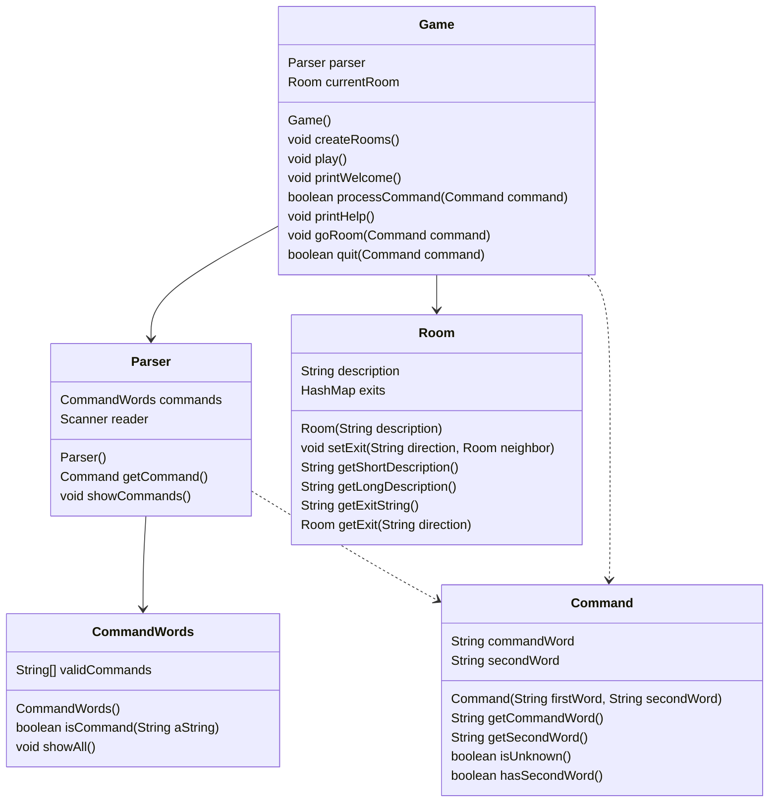

# 实训任务的报告

## 样例工程的代码结构分析

```mermaid
classDiagram
class Game
    Game : Parser parser
    Game : Room currentRoom
    Game : Game()
    Game : void createRooms()
    Game: void play()
    Game: void printWelcome()
    Game: boolean processCommand(Command command)
    Game: void printHelp()
    Game: void goRoom(Command command)
    Game: boolean quit(Command command)
class Room
      Room: String description
      Room: HashMap<String, Room> exits
      Room: Room(String description)
      Room: void setExit(String direction, Room neighbor)
      Room: String getShortDescription()
      Room: String getLongDescription()
      Room: String getExitString()
      Room: Room getExit(String direction)
class Parser
      Parser: CommandWords commands
      Parser: Scanner reader
      Parser: Parser()
      Parser: Command getCommand()
      Parser: void showCommands()
class Command
      Command: String commandWord
      Command: String secondWord
      Command: Command(String firstWord, String secondWord)
      Command: String getCommandWord()
      Command: String getSecondWord()
      Command: boolean isUnknown()
      Command: boolean hasSecondWord()
class CommandWords
      CommandWords: String[] validCommands
      CommandWords: CommandWords()
      CommandWords: boolean isCommand(String aString)
      CommandWords: void showAll()
Game --> Parser
Game --> Room
Game ..> Command
Parser --> CommandWords
Parser ..> Command
```

## 自己改进的功能实现说明