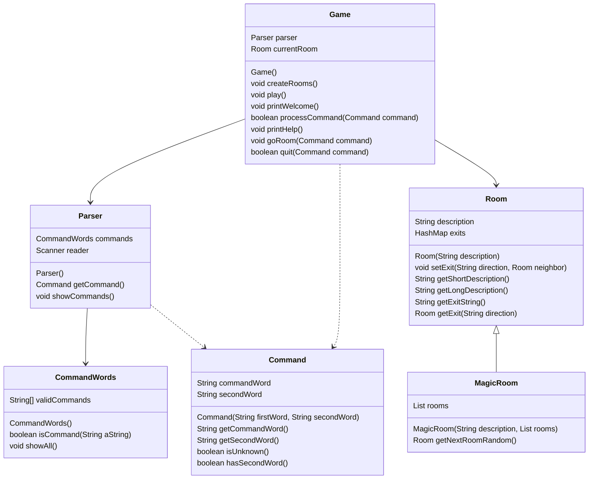

# 实训任务的报告

## 样例工程的代码结构分析



## 自己改进的功能实现说明

### 需要改进的地方:

在Game类的processCommand()方法中，当用户输入的命令被辨认出来以后，有一系列的if语句用来分派程序到不同的地方去执行。从面向对象的设计原则来看，这种解决方案不太好，因为每当要加入一个新的命令时，就得在这一堆if语句中再加入一个if分支，最终会导致这个方法的代码膨胀得极其臃肿。如何改进程序中的这个设计，使得命令的处理更模块化，且新命令的加入能更轻松？请描述你的解决思路，并对你的解决方案进行实现和测试。

### 我的改进:

"Replace Conditional with Polymorphism": 利用多态来消除多重分支,并使得命令的处理更加模块化

首先设计一个接口:
```java
    /**
    * 动作接口, 用于多态
    */
    
    package cn.edu.whut.sept.zuul;
    
    import java.util.HashMap;
    
    public interface Action {
        public Parser parser = new Parser();
        
            /**
             *
             * @param params 所有关于游戏的参数的封装
             * @return 所有关于游戏的参数的封装, 对params做出改变
             */
            public Params doAction(Params params);
    }
```


再设计一个DTO，用来传递变量:
```java

package cn.edu.whut.sept.zuul;
    
    public class Params {
    
        private Command command;
        private Room room;
        private boolean wantToQuit;
    
        public Command getCommand() {
            return command;
        }
    
        public void setCommand(Command command) {
            this.command = command;
        }
    
        public Room getRoom() {
            return room;
        }
    
        public void setRoom(Room room) {
            this.room = room;
        }
    
        public boolean isWantToQuit() {
            return wantToQuit;
        }
    
        public void setWantToQuit(boolean wantToQuit) {
            this.wantToQuit = wantToQuit;
        }
    }
```
    

再写接口实现类(即实现了各个指令的具体行为):

GoAction:

```java
package cn.edu.whut.sept.zuul;
    
    public class GoAction implements Action{

    /**
     * 执行go指令，向房间的指定方向出口移动，如果该出口连接了另一个房间，则会进入该房间，
     * 否则打印输出错误提示信息.
     */
    @Override
    public Params doAction(Params params) {
        Params result = new Params();
        Command command = params.getCommand();
        Room currentRoom = params.getRoom();

        if(!command.hasSecondWord()) {
            // if there is no second word, we don't know where to go...
            System.out.println("Go where?");
            return null;
        }

        String direction = command.getSecondWord();

        // Try to leave current room.
        Room nextRoom = currentRoom.getExit(direction);

        if (nextRoom == null) {
            System.out.println("There is no door!");
        }
        else {
            currentRoom = nextRoom;
            System.out.println(currentRoom.getLongDescription());
        }

        result.setRoom(currentRoom); // 只改变了room
        return result;
    }
```
QuitAction:

```java
    package cn.edu.whut.sept.zuul;

    public class QuitAction implements Action{
    
        /**
         * 执行Quit指令，用户退出游戏。如果用户在命令中输入了其他参数，则进一步询问用户是否真的退出.
         * @return 如果游戏需要退出则返回true，否则返回false.
         */
        @Override
        public Params doAction(Params params) {
            Params result = new Params();
            Command command = params.getCommand();
            if(command.hasSecondWord()) {
                System.out.println("Quit what?");
                result.setWantToQuit(false);
            } else {
                result.setWantToQuit(true); // signal that we want to quit
            }
            return result;
        }
    }

```

HelpAction:

```java

    package cn.edu.whut.sept.zuul;
    
    public class HelpAction implements Action{
    
        /**
         * 执行help指令，在终端打印游戏帮助信息.
         * 此处会输出游戏中用户可以输入的命令列表
         */
        @Override
        public Params doAction(Params params) {
            System.out.println("You are lost. You are alone. You wander");
            System.out.println("around at the university.");
            System.out.println();
            System.out.println("Your command words are:");
            parser.showCommands();
            return params;
        }
    }

```

Game类的processCommand()方法中的多态调用:
    
```java

/**
 * 执行用户输入的游戏指令.
 * @param command 待处理的游戏指令，由解析器从用户输入内容生成.
 * @return 如果执行的是游戏结束指令，则返回true，否则返回false.
 */
private boolean processCommand(Command command)
{
        boolean wantToQuit = false;

        // 指令中没有有效动作
        if(command.isUnknown()) {
        System.out.println("I don't know what you mean...");
        return false;
        }

        //指令中含有有效动作
        String commandWord = command.getCommandWord();
        Action action = CommandWords.actions.get(commandWord); // 多态, 获取动作对象
        Params data = new Params(); // 用于封装当前变量(状态)
        data.setCommand(command);
        data.setRoom(currentRoom);
        Params result = action.doAction(data); // 多态 返回更改后的变量(状态)
        currentRoom = result.getRoom(); // 变量更新
        wantToQuit = result.isWantToQuit(); // 变量更新
        // else command not recognised.
        return wantToQuit;
}

```

动作对象的获取: 首先在CommandWords中注册:

```java
    public static HashMap<String, Action> actions = null;

    static {
        actions = new HashMap<String, Action>();
        actions.put("go", new GoAction());
        actions.put("quit", new QuitAction());
        actions.put("help", new HelpAction());
    }
```

### 当需要加入一个新的命令时:

1. 创建实现了Action接口的动作类, 在doAction方法中实现动作的具体内容(Tip: 可能有部分传参与返回值的修改需要在Game类的processCommand方法中微调)
2. 在CommandWords类中注册: validCommands成员变量中添加指令名, actions添加指令名-动作类的映射关系

## 自己补充的功能实现说明

### 1.扩展游戏，使得一个房间里可以存放任意数量的物件，每个物件可以有一个描述和一个重量值，玩家进入一个房间后，可以通过“look”命令查看当前房间的信息以及房间内的所有物品信息:

1. 写一个物品类: `Material`
2. 为Room类添加容器存放物品对象: `private List<Material> materials; //房间中物品` 
3. 创建LookAction类, 实现Action接口的doAction()方法
4. CommandWords类中注册LookAction类: 成员变量validCommands中添加"look", 成员变量actions中添加"look" - new LookAction()
5. 详细实现见代码

### 2.在游戏中实现一个“back”命令，玩家输入该命令后会把玩家带回上一个房间:
1. 写一个记录类: `Record`, 声明一个成员变量` public static List<Room> roomList = new ArrayList<>();`
2. 在goAction的doAction()方法中, 当前房间每改变一次, 就将当前房间添加到roomList中
3. 创建BackAction类, 实现Action接口的doAction()方法
4. CommandWords类中注册BackAction类: 成员变量validCommands中添加"back", 成员变量actions中添加"back" - new BackAction()
5. 详细实现见代码

### 3.在游戏中增加具有传输功能的房间，每当玩家进入这个房间，就会被随机地传输到另一个房间:
1. 写一个传送房间类: `MagicRoom`, 继承房间类`Room`
2. 在Game的processCommand方法中, 每当进入一个新房间, 就校验是否是运行类型是否是MagicRoom, 如果是的, 则将当前房间变为随机一个房间

## 编写测试用例

在项目中利用了Maven包管理工具, 直接在pom.xml文件中添加了Junit4依赖以帮助开展单元测试

maven依赖:
```
    <dependencies>
        <!-- JUnit单元测试框架 -->
        <dependency>
            <groupId>junit</groupId>
            <artifactId>junit</artifactId>
            <version>4.12</version>
            <scope>test</scope>
        </dependency>
    </dependencies>
```

单元测试代码:

```java
package main.java.cn.edu.whut.sept.zuul;

import org.junit.Test;

public class TestMain {
    public TestMain() {
    }

    @Test
    public void main() {
        TestGame game = new TestGame();
        game.testPlay();
    }
}
```

```java
package test.java.cn.edu.whut.sept.zuul;


import main.java.cn.edu.whut.sept.zuul.TestMain;
import org.junit.runner.JUnitCore;
import org.junit.runner.Result;
import org.junit.runner.notification.Failure;

public class TestRunner {
    public static void main(String[] args) {
        Result result = JUnitCore.runClasses(TestMain.class);
        for (Failure failure : result.getFailures()) {
            System.out.println(failure.toString());
        }
        System.out.println("测试结果: " + result.wasSuccessful());
    }
}
```